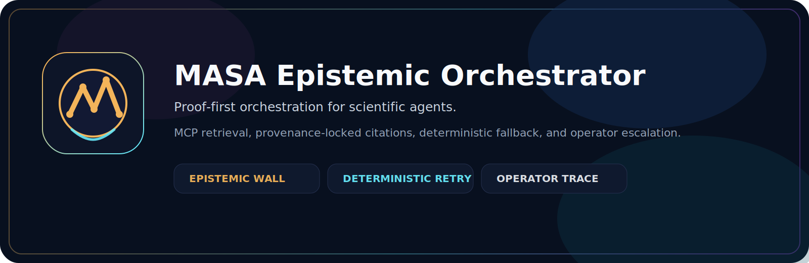

<p align="center">
  
</p>

<p align="center">
  
</p>

<h1 align="center">MASA Epistemic Orchestrator</h1>

<p align="center">
  Proof-first orchestration for scientific agents.
</p>

<p align="center">
  <a href="LICENSE"></a>
  <a href="README.md#test-status"></a>
  <a href="README.md#supported-paths"></a>
</p>

<p align="center">
  MCP retrieval, provenance-locked citations, deterministic fallback, and operator escalation.
</p>

MASA Epistemic Orchestrator is a research orchestration system for evidence-grounded scientific workflows. It combines MCP-based literature retrieval, strict transport validation, provenance-locked citation checks, deterministic fallback retries, and operator escalation.

## Why This Exists

Most agentic research pipelines fail in predictable ways:

- they cite sources that were never actually retrieved
- they accept malformed tool inputs and push ambiguity downstream
- they retry nondeterministically, making failures hard to debug
- they provide no operator-facing trace when the pipeline breaks

This project is designed to make those failures explicit and enforceable.

## At A Glance

- strict MCP boundary validation
- authoritative served-reference provenance tracking
- deterministic fallback retries with causal-lock semantics
- operator escalation with structured trace payloads
- one shared runtime boundary for both Claude and Codex

## Core Guarantees

The system is built around five guarantees:

1. MCP transport validation at the tool boundary
2. context-safe literature pagination
3. authoritative served-reference provenance tracking
4. deterministic fallback retries with locked sampling parameters
5. operator escalation payloads that are structured enough for human review

In practice, that means a Worker is not allowed to cite references it was never actually served, and the orchestrator can fail closed instead of silently accepting fabricated provenance.

## Architecture

The architecture has four major layers:

- `masa_mcp/`: literature retrieval transports for Codex and Claude
- `orchestrator/`: validation, retry, fixing, provenance enforcement, and SSE tracing
- `clients/`: model-provider abstraction and test doubles
- `console/`: operator-facing escalation and trace UI

The critical runtime boundary is `TaskExecutionSession`.

A correct execution sequence is:

1. call `literature_search`
2. ingest the server-owned tool output into the session ledger
3. execute the Worker only after authoritative provenance exists

This is what prevents citation drift between retrieval and synthesis.

## Visual Identity

The repository ships with a reusable MASA mark and hero artwork under `docs/assets/`.

- `docs/assets/masa-mark.svg`
- `docs/assets/masa-hero.svg`

Use the mark for docs, demos, and lightweight branding. If you want a GitHub social preview image, export the hero to PNG and upload it in the repository social preview settings.

## Repository Layout

```text
clients/        LLM client interfaces and mocks
console/        Operator console frontend
docs/           Architecture, security, deployment, and archived design notes
examples/       Claude, Codex, and end-to-end integration examples
masa_mcp/       MCP transports and tool schemas
orchestrator/   Core orchestration engine and epistemic enforcement
tests/          Unit and integration tests
```

## Supported Paths

### Codex

Codex uses the stdio MCP server.

Relevant file:

- `masa_mcp/literature_search_server.py`

### Claude

Claude uses the remote HTTP MCP transport.

Relevant file:

- `masa_mcp/http_server.py`

### Shared Runtime Boundary

Both Claude and Codex should use the same task-scoped session boundary:

- `orchestrator/runtime.py`

The session owns the authoritative served-reference ledger and normalizes transport result shapes before execution.

## Runtime Boundary

`TaskExecutionSession` is the shared execution boundary for both transports.

It is responsible for:

- ingesting server-owned MCP tool output
- extracting normalized text content from different transport result shapes
- building the authoritative served-reference ledger
- passing that ledger into the orchestration loop
- refusing execution if literature provenance has not been established

This is the key trust boundary in the system.

## Quickstart

### Python

```bash
python3 -m venv .venv
source .venv/bin/activate
pip install -r requirements.txt
```

### Run tests

```bash
pytest -q
```

### Run the stdio MCP server

```bash
python -m masa_mcp.literature_search_server
```

### Run the HTTP MCP server

```bash
python -m masa_mcp.http_server
```

### Run the operator SSE backend

```bash
python -m orchestrator.server
```

### Run the console

```bash
cd console
npm install
npm run dev
```

## Example Integration

A correct integration pattern looks like this:

```python
session = TaskExecutionSession(
    task=task,
    worker_client=worker_client,
    fixer_client=fixer_client,
)

tool_result = await call_literature_search(...)
session.ingest_tool_output("literature_search", tool_result)

log = await session.execute()
```

The important constraint is simple:

- never run the Worker before ingesting server-owned literature output

## Star History

[](https://star-history.com/#Lesz-Xi/masa-epistemic-orchestrator&Date)

## Security Model

This repository enforces an epistemic security model, not just a schema model.

The main protections are:

- malformed MCP inputs are rejected at the boundary
- literature pagination is bounded
- reference IDs are treated as server-owned provenance artifacts
- citation validation fails closed when authoritative provenance is missing
- fallback retries are deterministic
- escalation traces are structured for human review

This repository does not claim to solve arbitrary prompt injection or general agent safety. It is specifically designed to tighten evidence provenance and retry determinism in scientific orchestration workflows.

## Status

Current implemented areas include:

- strict MCP transport schemas
- stdio and HTTP literature retrieval
- provenance ledger parsing and collision checks
- deterministic fallback configuration
- fixer prompt hardening
- operator escalation payloads
- runtime session boundary for Claude and Codex result shapes

## Test Status

The repository includes targeted tests for:

- MCP argument validation
- pagination semantics
- served-reference ledger parsing
- fail-closed citation validation
- runtime session ingestion
- escalation payload construction
- orchestrator retry behavior

Before each public release, run:

```bash
pytest -q
cd console && npm run build
```

## Environment Variables

Common environment variables include:

- `SEMANTIC_SCHOLAR_API_KEY`
- `MASA_CHUNK_SIZE`
- `MASA_REQUEST_TIMEOUT`
- `MASA_MAX_TOTAL_RESULTS`
- `MASA_LOG_LEVEL`
- `MCP_CLIENT_ID`
- `MCP_CLIENT_SECRET`
- `MCP_TOKEN_SECRET`
- `MCP_PORT`
- `MCP_PUBLIC_HOST`
- `MASA_SSE_PORT`
- `MASA_WORKER_MODEL`
- `MASA_FIXER_MODEL`
- `MASA_MAX_ATTEMPTS`

See `.env.example` for the public template.

## Roadmap

Planned future work may include:

- richer end-to-end public examples
- broader operator workflows
- additional retrieval tools beyond literature search
- stronger deployment packaging
- richer live integration tests
- multi-step orchestration runners beyond the current session boundary

## Contributing

Pull requests are welcome for bug fixes, tests, transport hardening, and documentation improvements.

For security-sensitive issues, please follow the process in `SECURITY.md`.

## License

This project is released under the MIT License.
